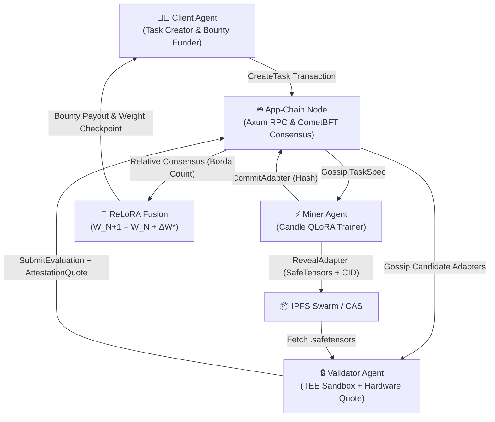
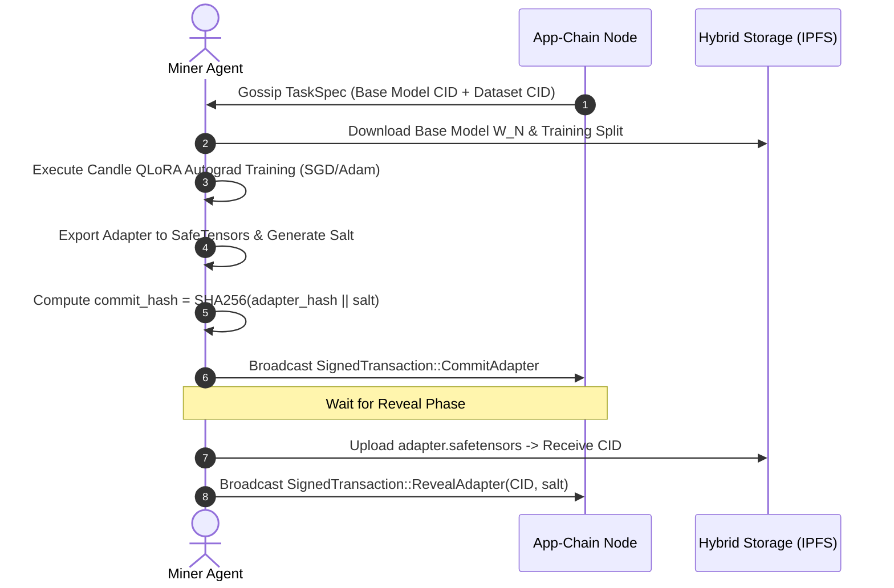
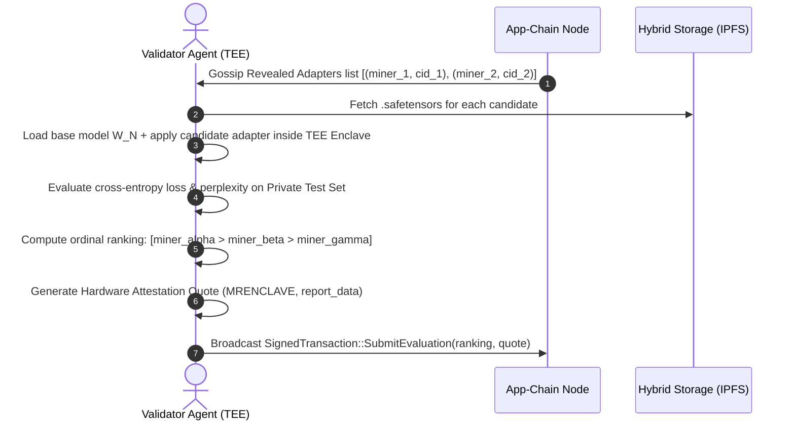

# 🤖 AGENTS.md : Autonomous Agent & Node Operator Guide

This document specifies the protocols, APIs, SDK tooling, and execution lifecycles for autonomous AI agents, automated miners, TEE validators, and node operators interacting with the **DePEFT Decentralized Parameter-Efficient Fine-Tuning Network**.

---

## 🏛️ Autonomous Agent Roles in DePEFT

DePEFT operates as an autonomous multi-agent decentralized economy with five primary agent personas:



| Agent Persona | Responsibility | Compute Profile | Cryptographic Role |
|---|---|---|---|
| **Client Agent** | Creates tasks, specifies base model & target modules, deposits bounty escrow | CPU / Lightweight | Signs `CreateTask` via Ed25519 |
| **Miner Agent** | Downloads base model, runs QLoRA autograd, commits/reveals adapters | GPU (CUDA/ROCm) / High-perf CPU | Signs `CommitAdapter` & `RevealAdapter` |
| **Validator Agent** | Runs evaluation in hardware TEE sandbox, benchmarks candidate models, ranks miners | Intel SGX / AMD SEV-SNP / AWS Nitro | Generates `AttestationQuote` & signs `SubmitEvaluation` |
| **Consensus Validator** | Proposes blocks, votes in 2-phase BFT commit, verifies TEE quotes | High-availability Node | Signs `PREVOTE` & `PRECOMMIT` |
| **Storage Gateway** | Pins datasets and `.safetensors` model weights to global IPFS network | IPFS Kubo Daemon / Filecoin | Resolves Content Identifiers (CIDs) |

---

## 🔑 Keypair & Identity Management for Autonomous Agents

Autonomous agents generate and maintain Ed25519 cryptographic keypairs for transaction authentication and balance management.

### Agent Keypair Generation (CLI / Rust)
```bash
cargo run -- key generate
```

### Agent Keypair Generation (Python SDK)
```python
from depeft import generate_keypair

account = generate_keypair()
print("Secret Key:", account["secret_key"])
print("Account ID:", account["account_id"])
```

Agents store their `secret_key` in secure environment variables:
```bash
export DEPEFT_AGENT_KEY="0x1a8f9c2d..."
export DEPEFT_NODE_URL="http://127.0.0.1:8545"
```

---

## 📡 HTTP REST / JSON-RPC Agent API Endpoints

Autonomous agents communicate with any live App-Chain Node over HTTP/JSON-RPC (default: `http://127.0.0.1:8545`).

### 1. Node Health & Chain Status
- **`GET /api/v1/status`**
  ```json
  {
    "block_height": 142,
    "tasks_count": 12,
    "storage_objects_count": 45,
    "connected_peers_count": 8,
    "version": "0.1.0-depeft"
  }
  ```

### 2. Query Account Balance
- **`GET /api/v1/accounts/{account_id}/balance`**
  ```json
  {
    "account": "0x404bb343...",
    "balance": 50000
  }
  ```

### 3. Testnet Faucet
- **`POST /api/v1/faucet`**
  - Payload:
  ```json
  {
    "account": "0x404bb343...",
    "amount": 10000
  }
  ```

### 4. Task Management Endpoints
- **`GET /api/v1/tasks`**: Returns array of all active `TaskSpec` records.
- **`GET /api/v1/tasks/{task_id}`**: Retrieves task configuration, dataset CID, base model ID, and current round state.

### 5. Signed Transaction Submission
- **`POST /api/v1/tx`**
  - Payload: `SignedTransaction`
  ```json
  {
    "tx": {
      "CreateTask": {
        "client": "0x404bb343...",
        "base_model_id": [81, 119, 101, 110, 47, 81, 119, 101, 110, 50, 46, 53, 45, 55, 66],
        "base_model_hash": [0, 0, 0, 0, 0, 0, 0, 0, 0, 0, 0, 0, 0, 0, 0, 0, 0, 0, 0, 0, 0, 0, 0, 0, 0, 0, 0, 0, 0, 0, 0, 0],
        "dataset_cid": [98, 97, 102, 121, 98, 101, 105...],
        "peft_method": "QLoRA_NF4",
        "max_rank": 16,
        "target_modules": [[113, 95, 112, 114, 111, 106], [118, 95, 112, 114, 111, 106]],
        "bounty_pool": 30000,
        "epoch_blocks": 50,
        "reward_distribution": { "TopKDecay": { "top_k": 5, "decay_rate": 0.5 } },
        "merge_strategy": { "EnsembleWeighted": { "top_k": 5 } }
      }
    },
    "sender_public_key": [64, 75, 179, 67...],
    "signature": [120, 40, 199, 145...]
  }
  ```

### 6. Content-Addressable Storage (CAS)
- **`POST /api/v1/storage`**: Uploads raw binary (hex encoded body), returns multihash CID.
- **`GET /api/v1/storage/{cid}`**: Downloads raw `.safetensors` model weights or dataset chunks.

---

## ⚡ Miner Agent Execution Loop

An automated Miner Agent performs the following steps during each ReLoRA tournament round:



### CLI Command for Miner Agent:
```bash
cargo run -- miner run \
  --node-url http://127.0.0.1:8545 \
  --secret-key 0x_miner_secret_key \
  --task-id 1 \
  --hardware "NVIDIA RTX 4090 / CUDA"
```

---

## 🔒 Validator Agent Execution Loop

An automated Validator Agent operates inside a protected Trusted Execution Environment (TEE) sandbox to evaluate candidate adapters against private test sets:



### CLI Command for Validator Agent:
```bash
cargo run -- validator run \
  --node-url http://127.0.0.1:8545 \
  --secret-key 0x_validator_secret_key \
  --task-id 1 \
  --hardware "Intel Xeon / AVX-512"
```

---

## 🛡️ Byzantine Fault Tolerant (BFT) Consensus Validator Agent

Consensus Validators participate in block proposing and 2-phase commit voting:

1. **PROPOSE**: Designated proposer selects valid mempool transactions and broadcasts a candidate block.
2. **PREVOTE**: Validators verify block hash, state root, and TEE attestation quotes, signing `VoteType::Prevote`.
3. **PRECOMMIT**: Upon receiving $> 2/3$ Prevotes (Proof-of-Lock), validators sign `VoteType::Precommit`.
4. **COMMIT**: Once $> 2/3$ Precommits are gathered, the block is finalized and appended to the immutable blockchain.

### CLI Command for BFT Consensus Testing:
```bash
cargo run -- bft-demo --validators 4 --blocks 5
```

---

## 🤖 Python Autonomous Agent Script Example

```python
from depeft import DePeftClient, generate_keypair
import time

client = DePeftClient("http://127.0.0.1:8545")
bot_account = generate_keypair()

# Request initial funds from faucet
client.request_faucet(bot_account["account_id"], 20000)

print(f"[*] Agent started with address: {bot_account['account_id']}")

while True:
    status = client.get_status()
    print(f"[#] Block #{status['block_height']} | Tasks: {status['tasks_count']}")
    
    tasks = client.get_tasks()
    for task in tasks:
        print(f"    - Task #{task['task_id']}: Bounty {task['bounty_pool']} $DEPEFT")
        
    time.sleep(10)
```
