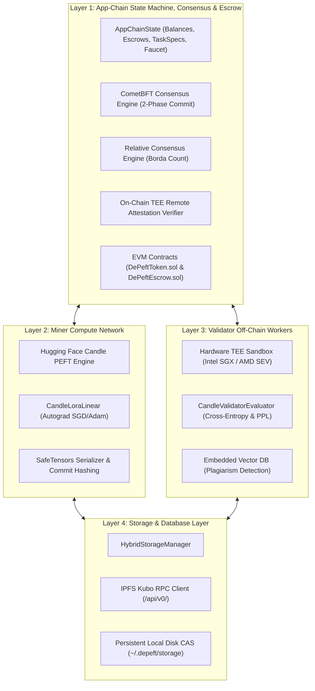

# 🏛️ DePEFT Architecture & Protocol Specification

DePEFT is an application-specific decentralized blockchain and compute protocol designed for **Decentralized Parameter-Efficient Fine-Tuning (PEFT)** of large language models (LLMs) using **ReLoRA multi-round weight evolution**, **Hardware TEE Remote Attestation**, **Relative Consensus rank aggregation**, **P2P Gossip networking**, and **Byzantine Fault Tolerant (BFT) State Finality**.

---

## 🏗️ The 4-Layer Architectural Design



---

## 1️⃣ Layer 1: App-Chain State Machine & Consensus

### 1.1 CometBFT 2-Phase Commit Consensus
The blockchain achieves deterministic instant finality with zero forks using a Tendermint/CometBFT 2-Phase Commit state machine:

$$\text{Quorum Threshold } = \left\lfloor \frac{2 \times P_{\text{total}}}{3} \right\rfloor + 1$$

- **Propose**: Weighted round-robin proposer creates a candidate block containing signed transactions and state root commitments.
- **Prevote**: Validators verify block validity and broadcast signed `VoteType::Prevote`. Reaching $> 2/3$ creates a **Proof-of-Lock (POL)**.
- **Precommit**: Validators broadcast signed `VoteType::Precommit`. Reaching $> 2/3$ finalizes the block.
- **Commit**: The block is appended to the immutable blockchain, state transitions applied, and height advanced ($H \leftarrow H + 1$).

### 1.2 Relative Consensus (Borda Count Rank Aggregation)
To eliminate floating-point divergence caused by non-deterministic GPU kernel execution across CUDA, ROCm, and AVX-512 architectures, the protocol translates raw loss values into ordinal rankings:

$$\text{Score}(M_i) = \sum_{v \in V} (N - \text{Rank}_v(M_i))$$

Where $N$ is the number of candidate miners, and $\text{Rank}_v(M_i)$ is the ordinal position assigned by validator $v$.

### 1.3 Smart Contracts & Escrow Settlement
- **`DePeftToken.sol`**: Standard ERC-20 token ($DEPEFT) for network utilities, bounty escrow, and staking.
- **`DePeftEscrow.sol`**: Manages client task funding and multi-round reward payouts directly to winning miners upon round finalization.

---

## 2️⃣ Layer 2: Miner Compute Network & Candle PEFT Engine

### 2.1 Low-Rank Adaptation (LoRA) Formulations
Base model weights $W \in \mathbb{R}^{d_{\text{out}} \times d_{\text{in}}}$ remain strictly frozen. The layer computes:

$$h = W x + \frac{\alpha}{r} (B A) x$$

Where:
- $A \in \mathbb{R}^{r \times d_{\text{in}}}$: Down-projection matrix initialized with random Gaussian distribution $\mathcal{N}(0, \sigma^2)$.
- $B \in \mathbb{R}^{d_{\text{out}} \times r}$: Up-projection matrix initialized to zero.
- $r \ll \min(d_{\text{in}}, d_{\text{out}})$: LoRA rank (typically $r \in \{8, 16, 32, 64\}$).
- $\alpha$: Scaling factor hyperparameter.

### 2.2 ReLoRA Multi-Round Continuous Weight Fusion
Upon conclusion of round $N$, the winning adapter $\Delta W^* = \frac{\alpha}{r} (B^* A^*)$ is permanently fused into the base checkpoint:

$$W_{N+1} = W_N + \frac{\alpha}{r} (B^* A^*)$$

The adapter matrices are subsequently re-initialized ($A \leftarrow \mathcal{N}(0, \sigma^2)$, $B \leftarrow 0$), enabling arbitrary sequence evolution without expanding parameter footprint.

---

## 3️⃣ Layer 3: Validator Off-Chain Workers & TEE Remote Attestation

### 3.1 Hardware TEE Security Model (Intel SGX / AMD SEV-SNP)
Validators evaluate candidate models inside protected hardware enclaves against private validation datasets. To ensure the integrity of evaluations, enclaves produce cryptographic **Remote Attestation Quotes**:

$$\text{report\_data} = \text{SHA512}\left(\text{task\_id} \mathbin{\Vert} \text{round} \mathbin{\Vert} \text{SHA256}(\text{ranking})\right)$$

The App-Chain on-chain verifier enforces:
1. `MRENCLAVE` matches an approved measurement registered in the on-chain governance whitelist.
2. `report_data` cryptographically matches the exact task, round, and submitted ranking.
3. The platform Quoting Enclave (QE) signature verifies against the hardware root key.

### 3.2 Anti-Collusion Commit-Reveal Protocol
- **Commit Phase**: Miners submit $\text{commit\_hash} = \text{SHA256}(\text{adapter\_hash} \mathbin{\Vert} \text{salt})$.
- **Reveal Phase**: Miners upload `.safetensors` to IPFS and reveal the salt.
- The App-Chain rejects any reveal where $\text{SHA256}(\text{SHA256}(\text{safetensors}) \mathbin{\Vert} \text{salt}) \neq \text{commit\_hash}$.

---

## 4️⃣ Layer 4: Decentralized Storage & Hybrid CAS

### 4.1 Content-Addressable Storage (CAS)
- **Local Disk Cache**: High-speed, persistent disk storage in `~/.depeft/storage/` computing SHA-256 multihash CIDs (`bafy...` / `Qm...`).
- **Live IPFS Kubo RPC (`/api/v0/`)**: Full integration with local or remote IPFS nodes via `/api/v0/add`, `/api/v0/cat`, and `/api/v0/pin`.
- **Embedded Vector Database**: Real-time cosine similarity indexing of adapter weight signatures for instantaneous plagiarism and duplicate detection:

$$\text{Similarity}(u, v) = \frac{u \cdot v}{\|u\|_2 \|v\|_2}$$

---

## 🌐 P2P Overlay Swarm Architecture

The P2P network layer operates over raw async TCP sockets using a **Length-Delimited framing codec**:

```text
+-------------------------+-----------------------------------------+
| Payload Length (4B BE)  |  Encrypted / Serialized JSON Payload    |
+-------------------------+-----------------------------------------+
```

### Gossip Flooding & LRU Deduplication
All transactions, block proposals, and IPFS CIDs are propagated across the overlay swarm. Each node maintains a thread-safe LRU cache of recently seen message hashes:

$$\text{message\_id} = \text{SHA256}(\text{serialized\_message})$$

Duplicate messages are dropped immediately, eliminating re-broadcast loops and minimizing bandwidth consumption.
