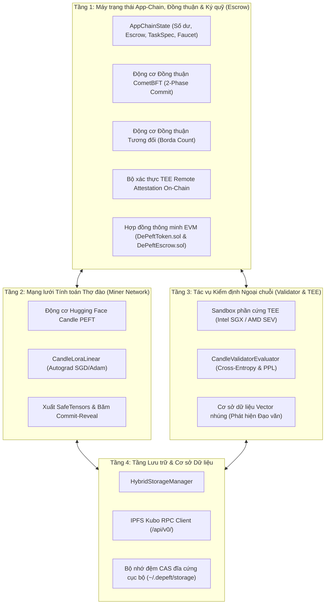

# 🏛️ Đặc tả Kiến trúc & Giao thức DePEFT

DePEFT là một blockchain chuyên dụng (application-specific blockchain / app-chain) và giao thức tính toán phi tập trung được thiết kế cho quá trình **Tinh chỉnh mô hình hiệu quả theo tham số phi tập trung (Decentralized Parameter-Efficient Fine-Tuning - PEFT)** đối với các mô hình ngôn ngữ lớn (LLMs), kết hợp **tiến hóa trọng số đa vòng ReLoRA**, **xác thực từ xa môi trường thực thi tin cậy phần cứng (Hardware TEE Remote Attestation)**, **đồng thuận tương đối qua tổng hợp xếp hạng Borda Count**, **mạng ngang hàng P2P Gossip**, và **tính tất định trạng thái kháng lỗi Byzantine (BFT State Finality)**.

---

## 🏗️ Thiết kế Kiến trúc 4 Tầng Cốt lõi



---

## 1️⃣ Tầng 1: Máy trạng thái App-Chain & Đồng thuận

### 1.1 Đồng thuận CometBFT 2-Phase Commit
Blockchain đạt được tính tất định tức thì (instant finality) và không xảy ra phân nhánh (zero forks) nhờ máy trạng thái 2-Phase Commit theo cơ chế Tendermint/CometBFT:

$$\text{Ngưỡng Quorum } = \left\lfloor \frac{2 \times P_{\text{total}}}{3} \right\rfloor + 1$$

- **Propose (Đề xuất)**: Validator đề xuất luân phiên theo trọng số (weighted round-robin) tạo khối ứng viên chứa các giao dịch đã ký và cam kết gốc trạng thái (state root commitment).
- **Prevote (Bỏ phiếu sơ bộ)**: Các validator kiểm tra tính hợp lệ của khối và phát sóng chữ ký `VoteType::Prevote`. Khi đạt $> 2/3$ phiếu, một **Bằng chứng Khóa (Proof-of-Lock - POL)** được xác lập.
- **Precommit (Cam kết sơ bộ)**: Các validator phát sóng chữ ký `VoteType::Precommit`. Khi đạt $> 2/3$ phiếu, khối được ấn định hoàn tất.
- **Commit (Xác nhận)**: Khối được ghi vào chuỗi bất biến, các chuyển dịch trạng thái được áp dụng và chiều cao khối tăng lên ($H \leftarrow H + 1$).

### 1.2 Đồng thuận Tương đối (Tổng hợp Xếp hạng Borda Count)
Nhằm loại bỏ hiện tượng trôi dấu phẩy động (floating-point divergence) do việc thực thi nhân GPU không tất định giữa các kiến trúc CUDA, ROCm và AVX-512, giao thức chuyển đổi điểm số loss thô thành thứ hạng tương đối:

$$\text{Điểm}(M_i) = \sum_{v \in V} (N - \text{Thứ\_hạng}_v(M_i))$$

Trong đó $N$ là số lượng thợ đào (miner) ứng viên, và $\text{Thứ\_hạng}_v(M_i)$ là vị trí thứ hạng được gán bởi validator $v$.

### 1.3 Hợp đồng Thông minh & Quyết toán Ký quỹ
- **`DePeftToken.sol`**: Token ERC-20 chuẩn ($DEPEFT) phục vụ tiện ích mạng lưới, ký quỹ tiền thưởng (bounty escrow) và staking.
- **`DePeftEscrow.sol`**: Quản lý quỹ tiền thưởng từ phía Client và tự động giải ngân phần thưởng từng vòng cho miner chiến thắng khi vòng đấu kết thúc.

---

## 2️⃣ Tầng 2: Mạng lưới Tính toán Thợ đào & Động cơ Candle PEFT

### 2.1 Công thức Thích ứng Thứ hạng Thấp (LoRA)
Trọng số mô hình nền tảng $W \in \mathbb{R}^{d_{\text{out}} \times d_{\text{in}}}$ được đóng băng hoàn toàn. Tầng tính toán thực hiện:

$$h = W x + \frac{\alpha}{r} (B A) x$$

Trong đó:
- $A \in \mathbb{R}^{r \times d_{\text{in}}}$: Ma trận chiếu xuống (down-projection) khởi tạo theo phân phối Gauss ngẫu nhiên $\mathcal{N}(0, \sigma^2)$.
- $B \in \mathbb{R}^{d_{\text{out}} \times r}$: Ma trận chiếu lên (up-projection) khởi tạo bằng 0.
- $r \ll \min(d_{\text{in}}, d_{\text{out}})$: Thứ hạng LoRA (LoRA rank, thông thường $r \in \{8, 16, 32, 64\}$).
- $\alpha$: Siêu tham số hệ số co giãn (scaling factor).

### 2.2 Hợp nhất Trọng số Tiến hóa Đa vòng ReLoRA
Khi kết thúc vòng đấu $N$, adapter chiến thắng $\Delta W^* = \frac{\alpha}{r} (B^* A^*)$ được hợp nhất vĩnh viễn vào checkpoint gốc:

$$W_{N+1} = W_N + \frac{\alpha}{r} (B^* A^*)$$

Sau đó, các ma trận adapter được tái khởi tạo lại ($A \leftarrow \mathcal{N}(0, \sigma^2)$, $B \leftarrow 0$), cho phép mô hình tiếp tục tiến hóa không giới hạn qua nhiều vòng mà không làm tăng kích thước tham số.

---

## 3️⃣ Tầng 3: Tác vụ Kiểm định Ngoại chuỗi & Xác thực TEE

### 3.1 Mô hình Bảo mật TEE Phần cứng (Intel SGX / AMD SEV-SNP)
Các Validator đánh giá các mô hình ứng viên bên trong môi trường enclave phần cứng cách ly an toàn dựa trên tập dữ liệu kiểm thử riêng tư (Private Validation Set). Để đảm bảo tính toàn vẹn của kết quả đánh giá, enclave tạo ra **Bằng chứng Xác thực Từ xa (Remote Attestation Quote)**:

$$\mathrm{report\_data} = \mathrm{SHA512}\left(\mathrm{task\_id} \mathbin{\Vert} \mathrm{round} \mathbin{\Vert} \mathrm{SHA256}(\mathrm{ranking})\right)$$

Bộ xác thực on-chain của App-Chain bắt buộc kiểm tra:
1. `MRENCLAVE` khớp với phép đo đã được phê duyệt trong danh sách trắng (whitelist) quản trị on-chain.
2. `report_data` ràng buộc khớp chính xác với task_id, round và bảng xếp hạng đã nộp.
3. Chữ ký của Quoting Enclave (QE) phần cứng hợp lệ với khóa gốc từ nhà sản xuất.

### 3.2 Giao thức Chống Thông đồng Commit-Reveal
- **Pha Commit**: Thợ đào gửi $\mathrm{commit\_hash} = \mathrm{SHA256}(\mathrm{adapter\_hash} \mathbin{\Vert} \mathrm{salt})$.
- **Pha Reveal**: Thợ đào tải tệp `.safetensors` lên IPFS và công bố chuỗi muối (salt).
- App-Chain từ chối mọi lượt công bố nếu $\mathrm{SHA256}(\mathrm{SHA256}(\mathrm{safetensors}) \mathbin{\Vert} \mathrm{salt}) \neq \mathrm{commit\_hash}$.

---

## 4️⃣ Tầng 4: Lưu trữ Phi tập trung & CAS Lai

### 4.1 Lưu trữ theo Nội dung Định danh (CAS)
- **Bộ đệm Đĩa Cục bộ**: Lưu trữ đĩa tốc độ cao, bền vững tại `~/.depeft/storage/`, tính toán định danh CID multihash SHA-256 (`bafy...` / `Qm...`).
- **Tích hợp IPFS Kubo RPC (`/api/v0/`)**: Tích hợp đầy đủ với node IPFS nội bộ hoặc từ xa thông qua các endpoint `/api/v0/add`, `/api/v0/cat` và `/api/v0/pin`.
- **Cơ sở dữ liệu Vector Nhúng**: Lập chỉ mục độ tương đồng Cosine theo thời gian thực đối với chữ ký trọng số của adapter nhằm phát hiện đạo văn hoặc sao chép ngay lập tức:

$$\mathrm{Similarity}(u, v) = \frac{u \cdot v}{\|u\|_2 \|v\|_2}$$

---

## 🌐 Kiến trúc Mạng Ngang hàng (P2P Overlay Swarm)

Tầng mạng P2P hoạt động trực tiếp trên các socket TCP bất đồng bộ sử dụng codec đóng khung **Length-Delimited**:

```text
+-------------------------+-----------------------------------------+
| Độ dài gói tin (4B BE)  |  Dữ liệu JSON mã hóa / tuần tự hóa      |
+-------------------------+-----------------------------------------+
```

### Lan truyền Gossip & Khử trùng lặp LRU
Tất cả các giao dịch, đề xuất khối và CID IPFS được lan truyền khắp mạng lưới P2P. Mỗi node duy trì một bộ nhớ đệm LRU thread-safe lưu trữ các mã băm thông điệp đã nhận gần đây:

$$\mathrm{message\_id} = \mathrm{SHA256}(\mathrm{serialized\_message})$$

Các thông điệp trùng lặp sẽ bị loại bỏ ngay lập tức, ngăn ngừa vòng lặp phát sóng lại và tiết kiệm tối đa băng thông mạng.
