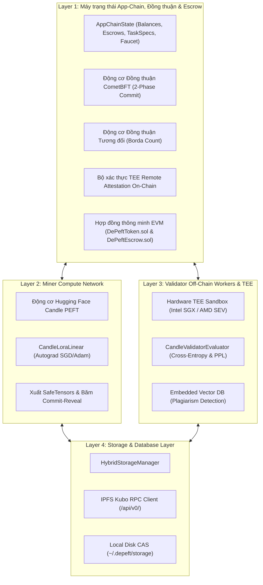

# 🏛️ Đặc tả Kiến trúc & Giao thức DePEFT

DePEFT là một app-chain và giao thức tính toán phi tập trung được thiết kế cho **Parameter-Efficient Fine-Tuning (PEFT)** đối với LLMs, kết hợp **tiến hóa trọng số đa vòng ReLoRA**, **Hardware TEE Remote Attestation**, **đồng thuận tương đối qua Borda Count**, **mạng P2P Gossip**, và **BFT State Finality**.

---

## 🏗️ Thiết kế Kiến trúc 4 Tầng Cốt lõi



---

## 1️⃣ Layer 1: App-Chain State Machine & Consensus

### 1.1 CometBFT 2-Phase Commit Consensus
Blockchain đạt được instant finality và zero forks nhờ máy trạng thái 2-Phase Commit theo cơ chế Tendermint/CometBFT:

$$\text{Quorum Threshold} = \left\lfloor \frac{2 \times P_{\text{total}}}{3} \right\rfloor + 1$$

- **Propose**: Validator đề xuất theo weighted round-robin tạo block ứng viên chứa các transaction đã ký và state root commitment.
- **Prevote**: Các validator kiểm tra tính hợp lệ của block và broadcast chữ ký `VoteType::Prevote`. Khi đạt $> 2/3$ phiếu, **Proof-of-Lock (POL)** được xác lập.
- **Precommit**: Các validator broadcast chữ ký `VoteType::Precommit`. Khi đạt $> 2/3$ phiếu, block được finalize.
- **Commit**: Block được ghi vào immutable blockchain, state transitions được áp dụng và block height tăng lên ($H \leftarrow H + 1$).

### 1.2 Relative Consensus (Borda Count Rank Aggregation)
Nhằm loại bỏ floating-point divergence do việc thực thi GPU kernel không tất định giữa các kiến trúc CUDA, ROCm và AVX-512, giao thức chuyển đổi loss thô thành ordinal ranking:

$$\text{Score}(M_i) = \sum_{v \in V} (N - \text{Rank}_v(M_i))$$

Trong đó $N$ là số lượng miner ứng viên, và $\text{Rank}_v(M_i)$ là vị trí thứ hạng được gán bởi validator $v$.

### 1.3 Smart Contracts & Escrow Settlement
- **`DePeftToken.sol`**: Token ERC-20 chuẩn ($DEPEFT) phục vụ network utilities, bounty escrow và staking.
- **`DePeftEscrow.sol`**: Quản lý bounty pool từ Client và tự động giải ngân phần thưởng từng vòng cho miner chiến thắng khi vòng đấu kết thúc.

---

## 2️⃣ Layer 2: Miner Compute Network & Candle PEFT Engine

### 2.1 Công thức Low-Rank Adaptation (LoRA)
Base model weights $W \in \mathbb{R}^{d_{\text{out}} \times d_{\text{in}}}$ được đóng băng hoàn toàn. Tầng tính toán thực hiện:

$$h = W x + \frac{\alpha}{r} (B A) x$$

Trong đó:
- $A \in \mathbb{R}^{r \times d_{\text{in}}}$: Down-projection matrix khởi tạo theo phân phối Gaussian $\mathcal{N}(0, \sigma^2)$.
- $B \in \mathbb{R}^{d_{\text{out}} \times r}$: Up-projection matrix khởi tạo bằng 0.
- $r \ll \min(d_{\text{in}}, d_{\text{out}})$: LoRA rank (thông thường $r \in \{8, 16, 32, 64\}$).
- $\alpha$: Scaling factor hyperparameter.

### 2.2 ReLoRA Multi-Round Continuous Weight Fusion
Khi kết thúc round $N$, winning adapter $\Delta W^* = \frac{\alpha}{r} (B^* A^*)$ được merge vĩnh viễn vào base checkpoint:

$$W_{N+1} = W_N + \frac{\alpha}{r} (B^* A^*)$$

Sau đó, các adapter matrices được tái khởi tạo ($A \leftarrow \mathcal{N}(0, \sigma^2)$, $B \leftarrow 0$), cho phép mô hình tiếp tục tiến hóa không giới hạn qua nhiều round mà không làm tăng parameter footprint.

---

## 3️⃣ Layer 3: Validator Off-Chain Workers & TEE Remote Attestation

### 3.1 Hardware TEE Security Model (Intel SGX / AMD SEV-SNP)
Các Validator đánh giá các candidate models bên trong isolated hardware enclaves dựa trên private validation dataset. Để đảm bảo tính toàn vẹn của kết quả đánh giá, enclave tạo ra **Remote Attestation Quote**:

$$\text{report\_data} = \text{SHA512}\left(\text{task\_id} \mathbin{\Vert} \text{round} \mathbin{\Vert} \text{SHA256}(\text{ranking})\right)$$

On-chain verifier của App-Chain bắt buộc kiểm tra:
1. `MRENCLAVE` khớp với measurement đã được phê duyệt trong on-chain governance whitelist.
2. `report_data` ràng buộc khớp chính xác với task_id, round và ranking đã nộp.
3. Chữ ký của hardware Quoting Enclave (QE) hợp lệ với root key của nhà sản xuất.

### 3.2 Anti-Collusion Commit-Reveal Protocol
- **Commit Phase**: Miner gửi $\text{commit\_hash} = \text{SHA256}(\text{adapter\_hash} \mathbin{\Vert} \text{salt})$.
- **Reveal Phase**: Miner upload file `.safetensors` lên IPFS và công bố salt.
- App-Chain từ chối mọi reveal nếu $\text{SHA256}(\text{SHA256}(\text{safetensors}) \mathbin{\Vert} \text{salt}) \neq \text{commit\_hash}$.

---

## 4️⃣ Layer 4: Decentralized Storage & Hybrid CAS

### 4.1 Content-Addressable Storage (CAS)
- **Local Disk Cache**: High-speed, persistent disk storage tại `~/.depeft/storage/`, tính toán SHA-256 multihash CID (`bafy...` / `Qm...`).
- **Tích hợp IPFS Kubo RPC (`/api/v0/`)**: Tích hợp trực tiếp với IPFS nodes qua `/api/v0/add`, `/api/v0/cat` và `/api/v0/pin`.
- **Embedded Vector Database**: Lập chỉ mục cosine similarity theo thời gian thực đối với adapter weight signatures nhằm phát hiện plagiarism hoặc duplicates ngay lập tức:

$$\text{Similarity}(u, v) = \frac{u \cdot v}{\|u\|_2 \|v\|_2}$$

---

## 🌐 P2P Overlay Swarm Architecture

Tầng mạng P2P hoạt động trực tiếp trên raw async TCP sockets sử dụng **Length-Delimited framing codec**:

```text
+-------------------------+-----------------------------------------+
| Payload Length (4B BE)  |  Encrypted / Serialized JSON Payload    |
+-------------------------+-----------------------------------------+
```

### Gossip Flooding & LRU Deduplication
Tất cả transaction, block proposal và IPFS CID được lan truyền khắp overlay swarm. Mỗi node duy trì thread-safe LRU cache lưu trữ recent message hashes:

$$\text{message\_id} = \text{SHA256}(\text{serialized\_message})$$

Duplicate messages bị drop ngay lập tức, loại bỏ re-broadcast loops và tối ưu băng thông mạng.
