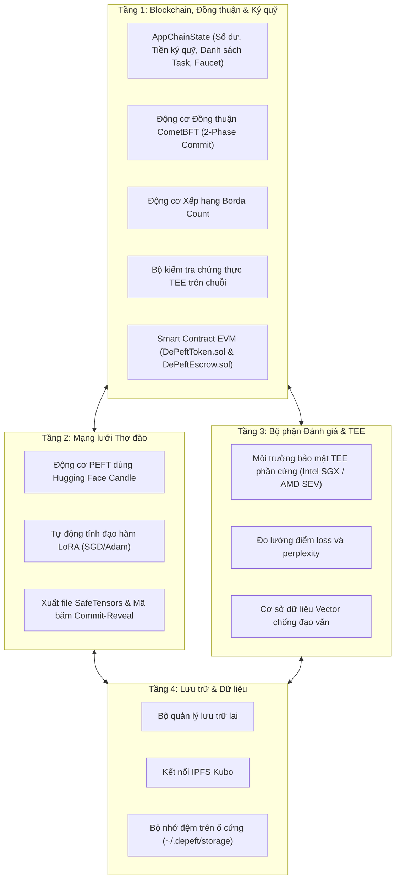

# 🏛️ Kiến trúc & Thiết kế Hệ thống DePEFT

DePEFT là nền tảng blockchain chuyên dụng (app-chain) và mạng tính toán phi tập trung phục vụ fine-tune các mô hình ngôn ngữ lớn (LLM) bằng phương pháp PEFT (Parameter-Efficient Fine-Tuning). Hệ thống kết hợp huấn luyện đa vòng ReLoRA, xác thực phần cứng TEE, cơ chế đồng thuận Borda Count, mạng P2P và bảo đảm tính toàn vẹn trạng thái bằng CometBFT.

---

## 🏗️ Thiết kế 4 Tầng Cốt lõi



---

## 1. Tầng 1: Trạng thái Chuỗi & Cơ chế Đồng thuận

### 1.1 Cơ chế Đồng thuận CometBFT 2-Phase Commit
Blockchain bảo đảm giao dịch được chốt ngay lập tức (instant finality) và không bị phân nhánh bằng thuật toán 2-Phase Commit:

- **Công thức tính đa số (Quorum Threshold)**:

$$\text{Quorum} = \lfloor 2 \times P / 3 \rfloor + 1$$

Trong đó $P$ là tổng quyền biểu quyết của mạng lưới.

- **Propose (Đề xuất)**: Validator được chọn sẽ tạo block mới gồm các giao dịch và mã băm trạng thái.
- **Prevote (Bỏ phiếu trước)**: Các validator kiểm tra block và gửi chữ ký Prevote. Đạt trên 2/3 phiếu sẽ tạo bằng chứng khóa block (Proof-of-Lock).
- **Precommit (Xác nhận trước)**: Các validator gửi chữ ký Precommit. Khi đạt trên 2/3 phiếu, block được duyệt hoàn tất.
- **Commit (Ghi nhận)**: Block được lưu vĩnh viễn vào chuỗi và tăng chiều cao khối thêm 1 đơn vị.

### 1.2 Cơ chế Đồng thuận Thứ hạng (Borda Count)
Do các loại card đồ họa (NVIDIA CUDA, AMD ROCm hay CPU) có sai số số thực rất nhỏ khi tính điểm loss, mạng lưới dùng bảng xếp hạng thứ tự thay vì lấy trung bình điểm số:

$$\text{Score}(M_i) = \sum_{v \in V} (N - \text{Rank}(v, M_i))$$

Trong đó $N$ là số lượng thợ đào tham gia, và $\text{Rank}(v, M_i)$ là thứ hạng do validator $v$ chấm cho thợ đào $M_i$.

### 1.3 Smart Contract & Trả thưởng
- **`DePeftToken.sol`**: Token chuẩn ERC-20 ($DEPEFT) dùng để thanh toán phí mạng, nạp tiền thưởng và tham gia staking.
- **`DePeftEscrow.sol`**: Quản lý tiền thưởng từ người tạo task và tự động giải ngân cho thợ đào thắng cuộc sau mỗi vòng.

---

## 2. Tầng 2: Mạng lưới Thợ đào & Huấn luyện LoRA

### 2.1 Cơ chế Huấn luyện LoRA
Trọng số gốc của mô hình $W$ luôn được giữ cố định. Thợ đào chỉ huấn luyện 2 ma trận nhỏ $A$ và $B$:

$$h = W \cdot x + \frac{\alpha}{r} (B \cdot A) \cdot x$$

Trong đó:
- Ma trận $A$ (thu nhỏ): khởi tạo ngẫu nhiên theo phân phối chuẩn.
- Ma trận $B$ (phóng to): khởi tạo bằng 0.
- $r$: Thứ hạng (rank) của LoRA (thường là 8, 16, 32 hoặc 64).
- $\alpha$: Hệ số phóng đại (scaling factor).

### 2.2 Ghép Trọng số Tiến hóa Đa vòng (ReLoRA)
Sau khi kết thúc mỗi vòng $k$, trọng số từ adapter tốt nhất $\Delta W$ sẽ được cộng thẳng vào mô hình gốc:

$$W_{k+1} = W_k + \frac{\alpha}{r} (B \cdot A)$$

Sau đó, hai ma trận $A$ và $B$ được tạo mới để tiếp tục vòng huấn luyện tiếp theo, giúp mô hình ngày càng thông minh hơn mà kích thước không bị phình to.

---

## 3. Tầng 3: Đánh giá Mô hình & Bảo mật TEE

### 3.1 Môi trường Bảo mật Phần cứng TEE (Intel SGX / AMD SEV)
Validator chạy việc kiểm tra mô hình bên trong một vùng an toàn của chip phần cứng (TEE Enclave) cùng tập dữ liệu bí mật. Sau khi chấm điểm, chip sẽ tạo một chứng chỉ mật mã:

```text
report_data = SHA512(task_id || round || SHA256(ranking))
```

Hệ thống trên chuỗi sẽ kiểm tra:
1. Giá trị `MRENCLAVE` có nằm trong danh sách phần mềm an toàn đã duyệt hay không.
2. Mã `report_data` có khớp đúng với task, vòng đấu và bảng xếp hạng đã nộp hay không.
3. Chữ ký phần cứng của chip có hợp lệ hay không.

### 3.2 Cơ chế Chống Gian lận Commit-Reveal
- **Bước Commit**: Thợ đào nộp mã băm:
```text
commit_hash = SHA256(adapter_hash || salt)
```
để giữ chỗ mà không bị lộ bài.
- **Bước Reveal**: Thợ đào tải file `.safetensors` lên IPFS và công bố chuỗi bí mật (salt).
- Hệ thống sẽ từ chối nếu file tải lên không tạo ra đúng mã băm đã commit trước đó.

---

## 4. Tầng 4: Hệ thống Lưu trữ & Cơ sở Dữ liệu

### 4.1 Lưu trữ Phân tán Định danh (CAS)
- **Bộ nhớ đệm Ổ cứng**: Lưu các file mô hình ở thư mục `~/.depeft/storage/` với mã nhận dạng CID SHA-256.
- **Kết nối IPFS Kubo**: Tải và lưu trữ dữ liệu với mạng IPFS thông qua các lệnh chuẩn.
- **Cơ sở Dữ liệu Vector Nhúng**: Tự động so khớp độ tương đồng của trọng số để phát hiện sao chép, gian lận:

$$\text{Similarity}(u, v) = \frac{u \cdot v}{\|u\| \cdot \|v\|}$$

---

## 🌐 Mạng Giao tiếp Ngang hàng (P2P Swarm)

Mạng P2P truyền nhận dữ liệu trực tiếp qua cổng TCP sử dụng định dạng gói tin có độ dài cố định:

```text
+-------------------------+-----------------------------------------+
| Chiều dài gói tin (4B)  |           Nội dung dữ liệu JSON         |
+-------------------------+-----------------------------------------+
```

### Lan truyền và Chống Gửi trùng Tin nhắn
Mọi giao dịch và khối mới được lan truyền tự động giữa các máy trong mạng. Mỗi node nhận diện tin nhắn qua mã băm:

```text
message_id = SHA256(serialized_message)
```

Nếu gặp tin nhắn đã nhận rồi thì hệ thống sẽ bỏ qua ngay, giúp tiết kiệm đường truyền mạng.

### Hỗ trợ Mạng Kép IPv4/IPv6 & Tuyến P2P Circuit Relay
Nhằm giải quyết triệt để vấn đề thợ đào tại nhà bị kẹt sau CGNAT (không có IP tĩnh, không mở được cổng router):
1. **Kết nối Dual-Stack IPv6:** Node tự động lắng nghe trên socket `[::]` để chấp nhận cả kết nối IPv6 Public trực tiếp và IPv4.
2. **Tuyến P2P Circuit Relay (`RelayForward` / `RelayPayload`):** Khi thợ đào bị kẹt sau CGNAT đối xứng, hai máy chủ động kết nối ra ngoài tới một Node Relay công khai (VPS). Node Relay sẽ chuyển tiếp dữ liệu an toàn mà không yêu cầu mở cổng router.

---

## 💰 5. Mô hình Kinh tế 3 Tầng & Cơ chế Đốt Token Giảm phát Động

### 5.1 Cơ chế Đốt Token Giảm phát Động (Dynamic Deflationary Burn)
Để cân bằng giữa lực xả của thợ đào và lực cầu của khách hàng:
$$\text{BurnRate} = \text{clamp}\left(0.005 + (N_{\text{tasks}} - 1) \times 0.015,\ 0.005,\ 0.10\right)$$
- **Khi Client khan hiếm (1 Task):** Tỷ lệ đốt giảm xuống $\approx 0.5\%$ để dồn tối đa $99.5\%$ bounty nuôi sống Miner và Validator.
- **Khi Client bùng nổ ($\ge 8$ Tasks):** Tỷ lệ đốt chạm trần $10\%$, tiêu hủy lượng lớn token khỏi lưu thông để gia tăng giá trị đồng tiền.

### 5.2 Phân bổ Bounty 3 Tầng Cân bằng Cung - Cầu
Phần bounty còn lại sau khi trừ đi lượng đốt được phân phối theo nguyên lý đàn hồi:
$$\text{Distributable Bounty} = \text{Total Available Bounty} - \text{Burned Bounty}$$
1. **Tầng 1 - Node Hạ tầng & Lưu trữ IPFS (5% - 15%):** Đàn hồi tăng dần theo lưu lượng file model `.safetensors` truyền tải qua mạng.
2. **Tầng 2 - TEE Validator Phần cứng (15% - 45%):** Đàn hồi tăng vọt khi máy chủ Intel SGX khan hiếm so với số lượng miner ($\frac{\text{Miners}}{\text{Validators}}$).
3. **Tầng 3 - Thợ đào Cạnh tranh (40% - 80%):** Nhận toàn bộ phần bounty chủ lực còn lại theo xếp hạng Borda Count (Top-K Decay hoặc Winner-Takes-All).

