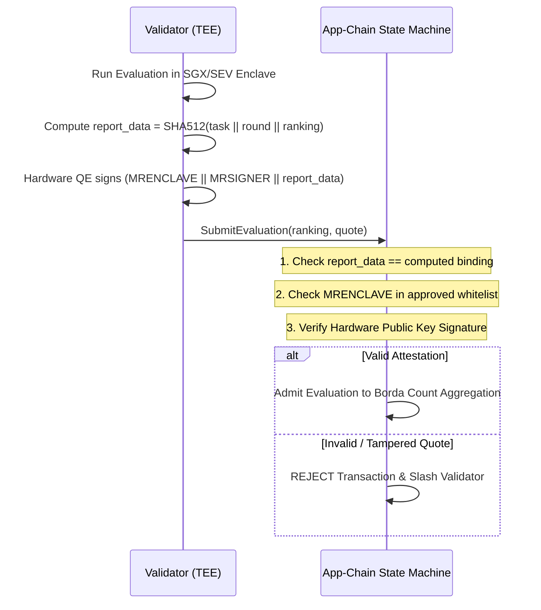

# 🔒 Security Policy & Threat Model

DePEFT implements a defense-in-depth security architecture designed to defend decentralized AI training against adversarial participants, malicious validators, sybil attacks, and hardware drift.

---

## 🛡️ Threat Model & Cryptographic Mitigations

| Threat Vector | Attack Scenario | Protocol Mitigation |
|---|---|---|
| **Adapter Front-Running & Plagiarism** | A malicious miner snoops on the P2P network, steals another miner's adapter weights, and claims the reward. | **2-Phase Commit-Reveal Scheme**: Miners commit $\text{SHA256}(\text{hash} \mathbin{\Vert} \text{salt})$ during Commit Phase. Revealed weights are checked against the Embedded Vector DB for $> 0.98$ cosine similarity duplication. |
| **Trojan & Backdoor Injection (Sleeper Agents)** | A miner embeds a secret trigger phrase (e.g. `\|ADM_EXEC\|`) while maintaining low loss on domain data. | **TEE Safety & Backdoor Probing**: The TEE evaluator injects safety and prompt injection probe suites (`SAFETY_BACKDOOR_PROBES`) into the private evaluation pipeline. |
| **Tactical & Strategic Voting Manipulation** | Colluding validators rank a targeted competitor miner last to skew Borda count points. | **Trimmed Borda Consensus (Outlier Filtering)**: The Relative Consensus Engine dynamically trims extreme outlier rankings when $\ge 4$ validators submit reports, neutralizing strategic down-voting. |
| **Side-Channel Timing Leakage in TEE** | A validator profiles execution latency to infer prompt length and dataset distribution. | **Fixed Tensor Batch Padding**: All evaluation sequences are padded to uniform dimensional tensors, ensuring constant-time matrix multiplications. |
| **Test Set Memorization & Overfitting** | Miners overfit their adapters to the validation benchmark to score artificially high. | **TEE Enclave Sealing**: The Private Test Set is strictly sealed inside hardware TEE Enclaves (Intel SGX / AMD SEV-SNP) and is never accessible to miners. |
| **Validator Evaluation Fraud & Collusion** | A corrupt validator reports arbitrary loss rankings to favor a colluding miner. | **Cryptographic Remote Attestation**: The App-Chain enforces valid `MRENCLAVE` measurement, platform signature verification, and exact binding of `report_data = SHA512(task || round || ranking)`. |
| **Floating-Point Non-Determinism Drift** | Heterogeneous GPU architectures (CUDA vs ROCm vs CPU) compute slightly different IEEE 754 floats, causing consensus forks. | **Relative Consensus (Borda Count)**: The blockchain aggregates ordinal rankings ($A > B > C$) rather than raw floating-point loss averages. |
| **Byzantine Double Voting / Equivocation** | A malicious validator signs two conflicting blocks/votes at the same height to fork the chain. | **On-Chain Slashing Engine**: Cryptographic equivocation proofs immediately slash validator stake and revoke voting power. |
| **Sybil Network Flooding** | An adversary spins up hundreds of nodes to exhaust network resources. | **Escrow Requirements & Deduplication**: Tasks require locked token bounty escrows; P2P messages use SHA-256 LRU deduplication. |

---

## 🔍 On-Chain TEE Verification Flow

---

## 📢 Responsible Vulnerability Disclosure

If you discover a security vulnerability in DePEFT (such as a cryptographic bypass, TEE attestation flaw, consensus safety bug, or potential exploit), please report it responsibly using **GitHub Private Vulnerability Reporting**:

- **Recommended Channel**: Navigate to the [Security Advisories tab](https://github.com/KhoaIsReal/DePEFT/security/advisories/new) of this repository and click **"Report a vulnerability"** to submit a secure, private advisory.
- **Privacy & Encryption**: Private vulnerability reports are strictly accessible only to the repository maintainer and the reporter, ensuring zero public exposure before a fix is published.
- **Report Details**: Please include a detailed technical description, minimal reproduction steps, proof-of-concept (PoC) code, and the affected module paths.
- **Response Commitment**: We acknowledge valid reports within 24–48 hours, coordinate patch verification privately, and publish coordinated advisories with proper credit.
