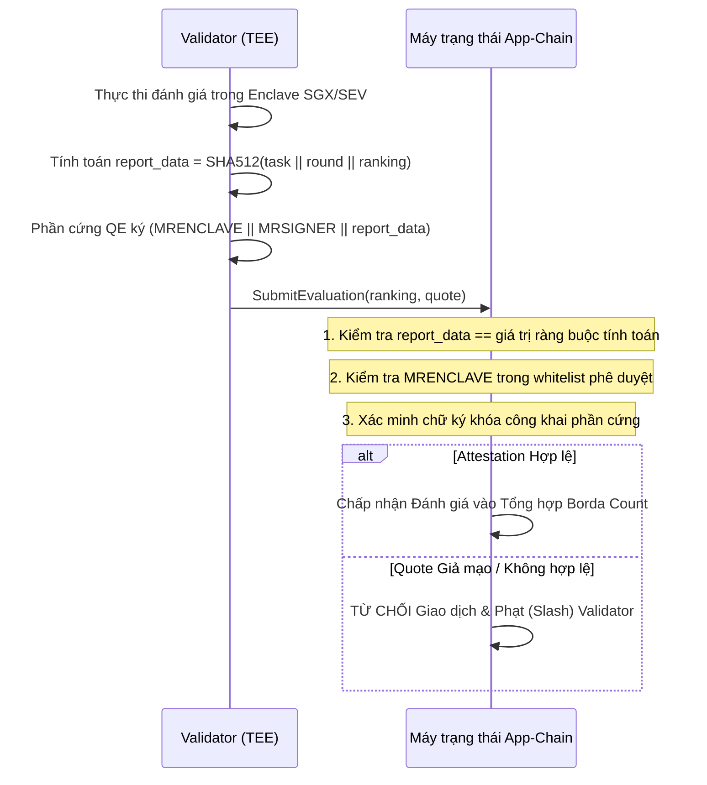

# 🔒 Chính sách Bảo mật & Mô hình Mối đe dọa

DePEFT áp dụng kiến trúc bảo mật đa tầng (defense-in-depth) được thiết kế nhằm bảo vệ hệ thống huấn luyện AI phi tập trung trước các tác nhân đối kháng, validator độc hại, tấn công sybil và sai số trôi phần cứng.

---

## 🛡️ Mô hình Mối đe dọa & Biện pháp Mật mã học

| Vector Mối đe dọa | Kịch bản Tấn công | Giải pháp của Giao thức |
|---|---|---|
| **Chạy trước (Front-Running) & Đạo văn Adapter** | Thợ đào độc hại theo dõi mạng P2P, sao chép trọng số adapter của thợ đào khác và nhận thưởng. | **Cơ chế Commit-Reveal 2 Pha**: Thợ đào gửi cam kết $\text{SHA256}(\text{hash} \mathbin{\Vert} \text{salt})$ trong Pha Commit. Khi công bố ở Pha Reveal, trọng số được đối chiếu qua Vector DB nhúng với ngưỡng độ tương đồng Cosine $> 0.98$ để phát hiện sao chép. |
| **Cài cắm Trojan & Backdoor (Sleeper Agents)** | Thợ đào chèn một cụm từ kích hoạt bí mật (vd: `\|ADM_EXEC\|`) trong khi vẫn duy trì điểm loss thấp trên dữ liệu chuẩn. | **Kiểm tra Backdoor & An toàn trong TEE**: Bộ đánh giá TEE đưa bộ probe kiểm tra an toàn và prompt injection (`SAFETY_BACKDOOR_PROBES`) vào quy trình đánh giá kín. |
| **Thao túng Bỏ phiếu Chiến lược (Tactical Voting)** | Nhóm validator thông đồng xếp hạng thợ đào đối thủ ở vị trí cuối để làm giảm điểm Borda. | **Đồng thuận Borda Cắt tỉa (Trimmed Borda / Lọc ngoại lai)**: Động cơ Relative Consensus tự động cắt tỉa các thứ hạng ngoại lai cực đoan khi có $\ge 4$ validator nộp kết quả, vô hiệu hóa việc cố tình đánh giá thấp. |
| **Rò rỉ Kênh phụ Thời gian (Side-Channel Timing) trong TEE** | Validator đo độ trễ thực thi để suy đoán độ dài câu nhắc và phân phối dữ liệu. | **Đệm Tensor Batch Cố định**: Toàn bộ chuỗi đánh giá được đệm (pad) thành các tensor có kích thước cố định, đảm bảo phép nhân ma trận diễn ra với thời gian hằng số (constant-time). |
| **Học vẹt & Overfitting Tập Kiểm thử** | Thợ đào ép overfit adapter vào dữ liệu kiểm thử để đạt điểm số cao ảo. | **Niêm phong Enclave TEE Phần cứng**: Tập dữ liệu kiểm tra riêng tư (Private Test Set) được niêm phong hoàn toàn bên trong TEE Enclave (Intel SGX / AMD SEV-SNP) và thợ đào không bao giờ có thể truy cập được. |
| **Gian lận Đánh giá & Thông đồng Validator** | Validator biến chất tự ý báo cáo thứ hạng loss giả mạo để ưu tiên thợ đào đồng minh. | **Bằng chứng Xác thực Từ xa (Remote Attestation)**: App-Chain bắt buộc kiểm tra số đo `MRENCLAVE` hợp lệ, xác minh chữ ký phần cứng và ràng buộc chính xác `report_data = SHA512(task || round || ranking)`. |
| **Trôi sai số Dấu phẩy động (Non-Determinism Drift)** | Các kiến trúc GPU không đồng nhất (CUDA, ROCm, CPU) tính toán float IEEE 754 lệch nhau nhẹ, gây rẽ nhánh đồng thuận. | **Đồng thuận Tương đối (Borda Count)**: Blockchain tổng hợp các thứ hạng tương đối ($A > B > C$) thay vì lấy giá trị trung bình loss số thực dấu phẩy động. |
| **Bỏ phiếu Kép Byzantine (Equivocation / Double Voting)** | Validator độc hại ký hai khối hoặc hai phiếu bầu xung đột ở cùng chiều cao để phân nhánh chuỗi. | **Cơ chế Phạt On-Chain (Slashing)**: Bằng chứng xung đột mật mã sẽ lập tức tịch thu tiền ký quỹ (slash stake) của validator và tước quyền biểu quyết. |
| **Tấn công Tràn ngập Sybil (Sybil Flooding)** | Kẻ tấn công tạo hàng trăm node giả để làm cạn kiệt tài nguyên mạng lưới. | **Yêu cầu Ký quỹ & Khử trùng lặp**: Các tác vụ bắt buộc phải ký quỹ tiền thưởng; các thông điệp P2P sử dụng cơ chế khử trùng lặp LRU SHA-256. |

---

## 🔍 Quy trình Xác thực TEE On-Chain

---

## 📢 Tiết lộ Lỗ hổng Bảo mật có Trách nhiệm

Nếu bạn phát hiện lỗ hổng bảo mật trong DePEFT (chẳng hạn như vượt qua kiểm tra mật mã, lỗi xác thực TEE attestation, lỗi an toàn đồng thuận BFT hoặc mã khai thác tiềm ẩn), vui lòng thông báo một cách có trách nhiệm:

- **Kênh Bảo mật Chính**: Liên hệ trực tiếp qua **Discord** (Nhắn tin trực tiếp cho maintainer / tham gia cộng đồng DePEFT).
- **Chi tiết Báo cáo**: Vui lòng cung cấp mô tả chi tiết, các bước tái hiện, mã bằng chứng khái niệm (Proof-of-Concept / PoC) và các đường dẫn module bị ảnh hưởng.
- **Cam kết Phản hồi**: Chúng tôi sẽ phản hồi các báo cáo hợp lệ trong vòng 24 giờ, điều phối xác minh bản vá kín và phát hành bản sửa lỗi nhanh chóng.
