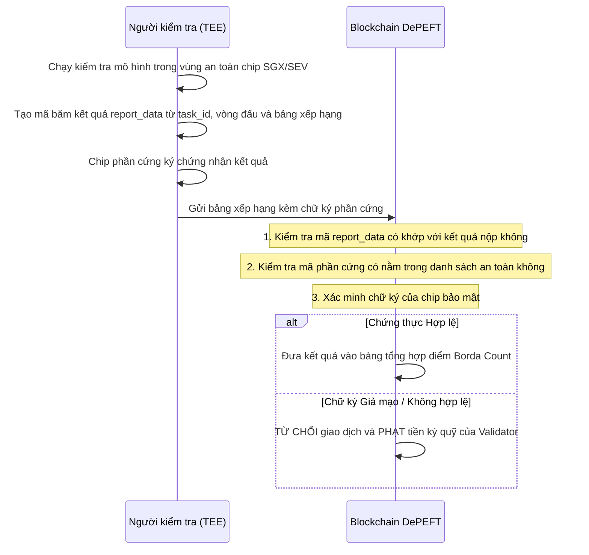

# 🔒 Chính sách Bảo mật & Các Mối Nguy Cơ

DePEFT được thiết kế nhiều lớp bảo vệ để ngăn chặn các hành vi gian lận, tấn công phá hoại và đảm bảo tính công bằng khi huấn luyện AI phi tập trung.

---

## 🛡️ Các Nguy cơ và Cách Hệ thống Phòng chống

| Nguy cơ Tấn công | Kịch bản Xảy ra | Cách DePEFT Phòng chống |
|---|---|---|
| **Sao chép và nộp bài trước (Front-Running / Đạo văn)** | Thợ đào xấu nhìn trộm file trọng số của người khác gửi lên mạng và nhanh tay nộp trước để cướp thưởng. | **Cơ chế nộp 2 bước (Commit-Reveal)**: Thợ đào phải gửi mã băm để khóa bài trước. Khi công bố file, hệ thống sẽ dùng Vector DB để đo độ giống nhau, nếu trùng lặp $> 0.98$ sẽ loại bỏ ngay. |
| **Cài cửa sau / Mã độc vào AI (Backdoor Injection)** | Thợ đào cố tình cài câu lệnh bí mật vào mô hình nhưng vẫn giữ điểm số bình thường trên dữ liệu mẫu. | **Bộ kiểm tra an toàn trong TEE**: Vùng bảo mật TEE sẽ tự động chèn các câu hỏi thử nghiệm để quét và phát hiện các mẫu cửa sau độc hại. |
| **Thông đồng dìm hàng nhau khi bỏ phiếu** | Nhóm người chấm điểm bắt tay nhau xếp đối thủ xuống cuối bảng để dìm điểm. | **Thuật toán lọc ngoại lai (Trimmed Borda)**: Hệ thống tự động gạt bỏ các mức chấm điểm chênh lệch bất thường khi có từ 4 validator trở lên. |
| **Đo thời gian để đoán dữ liệu trong TEE** | Người kiểm tra đo thời gian chạy để đoán độ dài câu chữ và dữ liệu bí mật. | **Cố định kích thước dữ liệu**: Tất cả dữ liệu đầu vào đều được chèn thêm khoảng trống để có cùng độ dài, giúp thời gian xử lý luôn bằng nhau. |
| **Học vẹt bộ dữ liệu kiểm tra (Overfitting)** | Thợ đào cố tình ép mô hình học thuộc lòng bộ đề kiểm tra để đạt điểm cao ảo. | **Khóa kín đề thi trong TEE**: Bộ dữ liệu chấm điểm được niêm phong trong chip TEE (Intel SGX / AMD SEV), thợ đào không có cách nào xem được đề. |
| **Gian lận khi chấm điểm** | Validator tự ý tạo ra bảng xếp hạng giả để giúp thợ đào quen biết thắng giải. | **Chứng thực từ chip phần cứng (Remote Attestation)**: Hệ thống chỉ nhận kết quả có chữ ký mã hóa trực tiếp từ chip bảo mật TEE khớp đúng với task và vòng đấu. |
| **Lệch điểm do khác loại card màn hình** | Các dòng card đồ họa (NVIDIA, AMD) tính số thập phân lệch nhau chút ít gây bất đồng thuận. | **Dùng thứ hạng thay vì điểm số**: Hệ thống chỉ lấy thứ tự nhất, nhì, ba ($A > B > C$) để tính điểm theo luật Borda Count. |
| **Bỏ phiếu 2 lần để phá hoại mạng (Double Voting)** | Validator ký 2 khối khác nhau ở cùng một thời điểm để làm phân nhánh chuỗi. | **Cơ chế phạt tiền ký quỹ (Slashing)**: Nếu bị phát hiện, validator sẽ bị tịch thu toàn bộ số tiền đã stake và tước quyền tham gia. |
| **Tấn công tràn ngập bằng nhiều tài khoản ảo (Sybil)** | Kẻ xấu tạo hàng loạt tài khoản để làm nghẽn mạng. | **Bắt buộc nạp tiền và lọc tin nhắn trùng**: Mọi tác vụ đều phải nạp tiền cọc; các tin nhắn trùng lặp sẽ bị mạng P2P bỏ qua ngay lập tức. |

---

## 🔍 Quy trình Kiểm tra Chứng thực TEE



---

## 📢 Hướng dẫn Báo cáo Lỗ hổng Bảo mật

Nếu bạn tìm thấy bất kỳ lỗ hổng bảo mật nào trong hệ thống DePEFT, xin vui lòng tuân thủ quy trình bảo mật:

- **Kênh báo cáo bắt buộc**: Toàn bộ thông tin về lỗ hổng bảo mật, lỗi khai thác hay bất kỳ vấn đề an toàn nào **BẮT BUỘC phải gửi độc quyền qua Tin nhắn Trực tiếp (DM) trên Discord** cho đội ngũ phát triển/core team chính thức.
  - **Discord Server Chính Thức**: [https://discord.gg/depeft](https://discord.gg/depeft)
  - **Biện pháp chống mạo danh**: Để tránh bị kẻ xấu lừa đảo, **CHỈ NHẮN TIN CHO NGƯỜI CÓ ROLE `Owner` HOẶC `Core Team`** trên danh sách thành viên của server. Đội ngũ phát triển sẽ **KHÔNG BAO GIỜ** chủ động nhắn tin trước cho bạn yêu cầu private key hay thông tin nhạy cảm.
- **Bắt buộc mã hóa tin nhắn bằng PGP / GPG**:
  - Để ngăn chặn các bot tự động trên Discord quét nội dung và nghe lén tin nhắn, **mọi báo cáo bảo mật bắt buộc phải được mã hóa bằng Public Key chính thức của chúng tôi trước khi gửi**.
  - **Tệp Khóa Công Khai (Public Key)**: [`depeft_security_pubkey.asc`](./depeft_security_pubkey.asc) (Fingerprint: `7EB0 6C51 4FDF A105 9613  7AF9 73D0 85A0 707B EEAD`).
  - **Cách mã hóa báo cáo**:
    ```bash
    # 1. Nạp khóa công khai vào máy của bạn
    gpg --import depeft_security_pubkey.asc

    # 2. Mã hóa nội dung báo cáo (tạo ra tệp report.txt.asc)
    gpg --armor --encrypt --recipient "security@depeft.network" report.txt
    ```
  - **Gửi qua Discord DM**: Sao chép toàn bộ khối ký tự mã hóa `-----BEGIN PGP MESSAGE----- ... -----END PGP MESSAGE-----` và gửi qua Discord DM cho Owner/Core Team. Chỉ có Private Key lưu ngoại tuyến của Core Team mới giải mã và đọc được nội dung.
- **Nội dung báo cáo**: Vui lòng mô tả chi tiết lỗi, các bước để tái hiện lỗi và đoạn mã khai thác mẫu (PoC) trong văn bản mã hóa.
- **Cam kết xử lý**: Chúng tôi sẽ phản hồi trong vòng 24 giờ, tiến hành vá lỗi kín và công bố bản sửa lỗi sớm nhất có thể.

