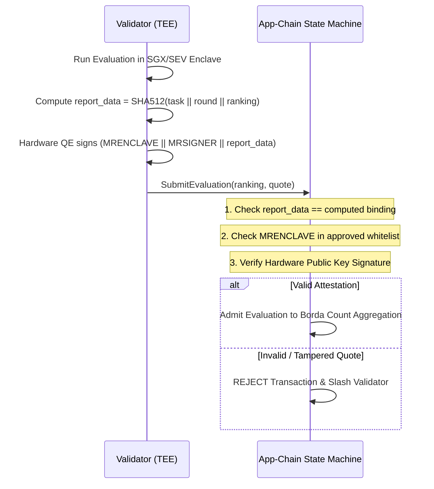

# 🔒 Security Policy & Threat Model

DePEFT áp dụng kiến trúc defense-in-depth security được thiết kế nhằm bảo vệ hệ thống decentralized AI training trước adversarial participants, malicious validators, sybil attacks và hardware drift.

---

## 🛡️ Threat Model & Cryptographic Mitigations

| Threat Vector | Attack Scenario | Protocol Mitigation |
|---|---|---|
| **Front-Running & Plagiarism Adapter** | Malicious miner theo dõi P2P network, sao chép adapter weights của miner khác và nhận thưởng. | **2-Phase Commit-Reveal Scheme**: Miner gửi commit $\text{SHA256}(\text{hash} \mathbin{\Vert} \text{salt})$ trong Commit Phase. Revealed weights được đối chiếu qua Embedded Vector DB với cosine similarity threshold $> 0.98$ để phát hiện duplicates. |
| **Trojan & Backdoor Injection (Sleeper Agents)** | Miner chèn secret trigger phrase (vd: `\|ADM_EXEC\|`) trong khi vẫn duy trì loss thấp trên domain data. | **TEE Safety & Backdoor Probing**: TEE evaluator đưa bộ `SAFETY_BACKDOOR_PROBES` và prompt injection probe suites vào private evaluation pipeline. |
| **Tactical & Strategic Voting Manipulation** | Nhóm colluding validators rank miner đối thủ ở vị trí cuối để dìm Borda count points. | **Trimmed Borda Consensus (Outlier Filtering)**: Relative Consensus Engine tự động trim các extreme outlier rankings khi có $\ge 4$ validators nộp reports, vô hiệu hóa strategic down-voting. |
| **Side-Channel Timing Leakage trong TEE** | Validator đo execution latency để suy đoán prompt length và dataset distribution. | **Fixed Tensor Batch Padding**: Toàn bộ evaluation sequences được padding thành uniform dimensional tensors, đảm bảo constant-time matrix multiplications. |
| **Test Set Memorization & Overfitting** | Miner overfit adapter vào validation benchmark để đạt điểm số cao ảo. | **TEE Enclave Sealing**: Private Test Set được seal hoàn toàn bên trong hardware TEE Enclaves (Intel SGX / AMD SEV-SNP) và miner không thể truy cập. |
| **Validator Evaluation Fraud & Collusion** | Corrupt validator báo cáo arbitrary loss rankings để ưu tiên colluding miner. | **Cryptographic Remote Attestation**: App-Chain bắt buộc kiểm tra `MRENCLAVE` measurement hợp lệ, verify platform signature và ràng buộc `report_data = SHA512(task || round || ranking)`. |
| **Floating-Point Non-Determinism Drift** | Heterogeneous GPU architectures (CUDA, ROCm, CPU) tính toán IEEE 754 float lệch nhau nhẹ, gây consensus forks. | **Relative Consensus (Borda Count)**: Blockchain tổng hợp ordinal rankings ($A > B > C$) thay vì lấy raw floating-point loss averages. |
| **Byzantine Double Voting / Equivocation** | Malicious validator ký 2 blocks/votes xung đột ở cùng block height để fork chain. | **On-Chain Slashing Engine**: Cryptographic equivocation proofs lập tức slash validator stake và thu hồi voting power. |
| **Sybil Network Flooding** | Adversary tạo hàng trăm nodes để làm cạn kiệt network resources. | **Escrow Requirements & Deduplication**: Tasks bắt buộc phải lock bounty token escrow; P2P messages sử dụng SHA-256 LRU deduplication. |

---

## 🔍 Quy trình On-Chain TEE Verification Flow

---

## 📢 Responsible Vulnerability Disclosure

Nếu bạn phát hiện lỗ hổng bảo mật trong DePEFT (chẳng hạn như cryptographic bypass, TEE attestation flaw, consensus safety bug hoặc potential exploit), vui lòng báo cáo có trách nhiệm:

- **Primary Security Channel**: Liên hệ trực tiếp qua **Discord** (Direct Message cho maintainer / join DePEFT community).
- **Report Details**: Vui lòng cung cấp mô tả chi tiết, reproduction steps, proof-of-concept (PoC) code và affected module paths.
- **Response Commitment**: Chúng tôi cam kết phản hồi các báo cáo hợp lệ trong vòng 24 giờ, điều phối private patch verification và phát hành bản sửa lỗi nhanh chóng.
